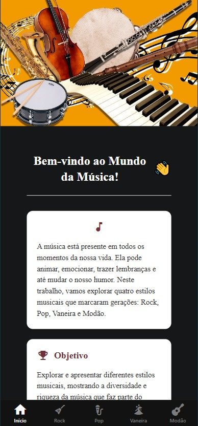
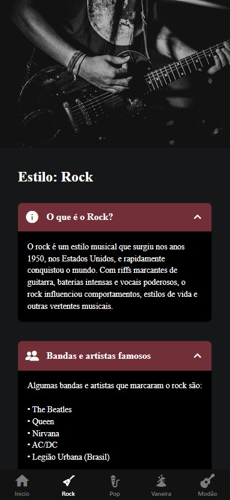
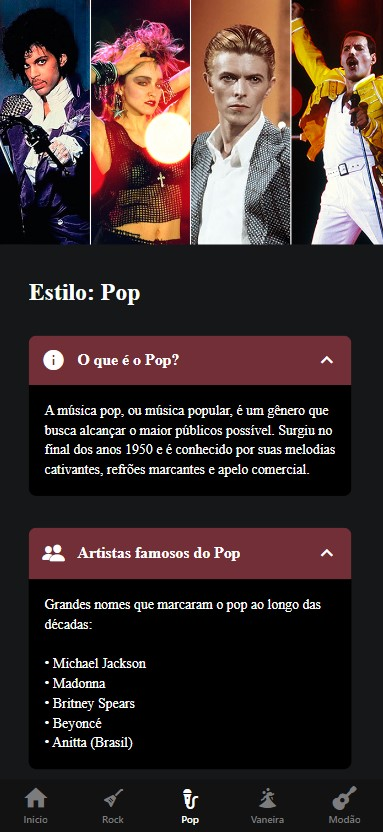
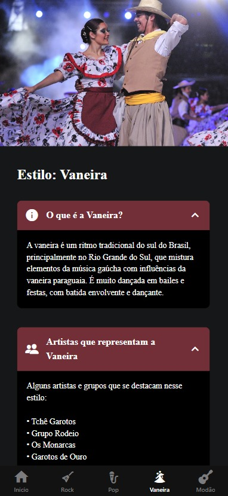
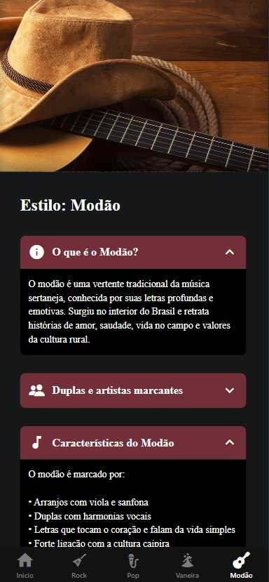

# 🎵 Mundo da Música - App de Estilos Musicais

Um aplicativo React Native que explora diferentes estilos musicais brasileiros e internacionais, com informações detalhadas sobre cada gênero.

## 📱 Telas do Aplicativo

### 🏠 Home
- Tela inicial com introdução ao mundo da música
- Cards informativos sobre o objetivo do app
- Design atraente com parallax scroll

### 🎸 Rock
- Informações sobre o gênero rock
- Bandas e artistas famosos
- Subgêneros do rock
- Player Spotify integrado

### 🎤 Pop
- Características da música pop
- Artistas internacionais e nacionais
- Explicação sobre sua popularidade
- Player Spotify integrado

### 💃 Vaneira
- Ritmo tradicional gaúcho
- Principais artistas do gênero
- Instrumentos característicos
- Player Spotify integrado

### 🪕 Modão
- História do modão brasileiro
- Duplas sertanejas tradicionais
- Importância cultural
- Player Spotify integrado

## 🛠 Tecnologias Utilizadas

- React Native
- Expo
- TypeScript
- Componentes personalizados:
  - `ParallaxScrollView`
  - `ThemedText` e `ThemedView`
  - `Collapsible` (acordeão informativo)
- Ícones do Material Icons e Ionicons
- Integração com Spotify (embed)

## 🎨 Design

- Paleta de cores principal: `#722f37` (vinho)
- Fontes personalizadas (Poppins)
- Cards com sombras e bordas arredondadas
- Headers com imagens temáticas
- Componentes colapsáveis para organização de conteúdo

## 🚀 Como Executar

1. Clone o repositório
2. Instale as dependências:
npm install
npx expo start

## Desenvolvido por Ana Roberta (3° Ano D)

